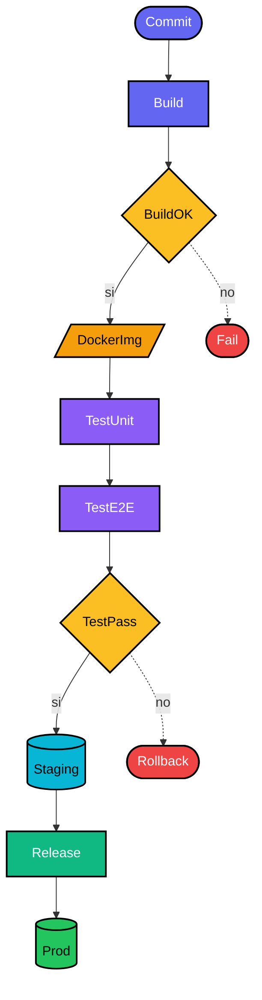

# Esempi del metodo Danilov

Esempi completi di prompt strutturati in formato Danilov, con e senza
estensione DanilovGoal.

---

## Esempio 1: diagramma Mermaid (pipeline di deployment)

Caso d'uso semplice: generare un singolo diagramma. Niente DanilovGoal
perché è un task one-shot.

### Prompt

```
INDICE
1 = stage
2 = decisione
3 = ambiente
4 = artefatto
5 = esito_finale
6 = colore
7 = forma
8 = relazione

DEFINIZIONI
@1[a]: name=Commit,   6=#6366F1, 7=stadium
@1[b]: name=Build,    6=#6366F1, 7=rect
@1[c]: name=TestUnit, 6=#8B5CF6, 7=rect
@1[d]: name=TestE2E,  6=#8B5CF6, 7=rect
@1[e]: name=Release,  6=#10B981, 7=rect
@2[a]: name=BuildOK,  6=#FBBF24, 7=diamond
@2[b]: name=TestPass, 6=#FBBF24, 7=diamond
@3[a]: name=Staging,  6=#06B6D4, 7=cylinder
@3[b]: name=Prod,     6=#22C55E, 7=cylinder
@4[a]: name=DockerImg,6=#F59E0B, 7=parallelogram
@5[a]: name=Fail,     6=#EF4444, 7=stadium
@5[b]: name=Rollback, 6=#EF4444, 7=stadium

RELAZIONI
@8[1]: @1[a]→@1[b]
@8[2]: @1[b]→@2[a]
@8[3]: @2[a]→@4[a], label=si
@8[4]: @2[a]→@5[a], label=no, style=dashed
@8[5]: @4[a]→@1[c]
@8[6]: @1[c]→@1[d]
@8[7]: @1[d]→@2[b]
@8[8]: @2[b]→@3[a], label=si
@8[9]: @2[b]→@5[b], label=no, style=dashed
@8[10]: @3[a]→@1[e]
@8[11]: @1[e]→@3[b]

OUTPUT: flowchart TD in sintassi Mermaid, applica colore e forma a ogni
nodo, applica label e style alle frecce.
```

### Output atteso (Mermaid)



---

## Esempio 2: prompt di generazione immagine (scacchiera moderna)

Caso d'uso: prompt per modello image-to-text. Si è dimostrato circa
10× più affidabile del corrispondente prompt in prosa per il rispetto
di valori esatti (hex, dimensioni, angoli).

### Prompt

```
INDICE
1  = scacchiera
2  = quadrato
3  = colore
4  = texture
5  = bordo
6  = inlay
7  = etichetta
8  = font
9  = superficie
10 = ombra
11 = luce
12 = stile

DEFINIZIONI
@1: 8×8
@2[d]: 3=#2B2D33, 4=matte+grana(0.15)
@2[l]: 3=#F5F0E8, 4=carta(0.20)
@5: gunmetal_spazzolato, riflettivita=0.03
@6: oro, larghezza=1mm
@7: [a-h]@bottom + [1-8]@left, 3=#D4C4A8, 8=sans-serif-thin, offset=outside
@9: noce_scuro
@10: ambient_occlusion, intensita=0.6, raggio=8mm
@11: angolo=315°, elevazione=35°, softness=0.7
@12: fotoreale, 4K, dof=0.3, focus=front

OUTPUT: rendering fotorealistico in 4K
```

### Versione prosa equivalente (per confronto)

> Crea una scacchiera moderna 8×8 con palette cromatica sofisticata.
> I quadrati scuri sono in antracite profondo (#2B2D33) con texture
> matte... [continua per altre 8 righe di descrizione]

La versione Danilov è ~40% più compatta in token e tende a produrre
output più fedeli ai valori esatti.

---

## Esempio 3: piano eseguibile con DanilovGoal (onboarding SaaS)

Caso d'uso: piano multi-step che va eseguito, tracciato, e validato
alla fine. Include l'estensione DanilovGoal.

### Prompt

```
HEADER
GOAL:   flowchart di onboarding utente SaaS
SLUG:   onboarding-saas
OUTPUT: mermaid

INDICE
1 = nodo
2 = colore
3 = forma
4 = relazione

DEFINIZIONI
@1[a]: name=Signup,  2=#3B82F6, 3=stadium, bit=0  → 0x001
@1[b]: name=Email,   2=#3B82F6, 3=rect,    bit=1  → 0x002
@1[c]: name=Verify,  2=#FBBF24, 3=diamond, bit=2  → 0x004
@1[d]: name=Profile, 2=#8B5CF6, 3=rect,    bit=3  → 0x008
@1[e]: name=Active,  2=#22C55E, 3=stadium, bit=4  → 0x010
@1[f]: name=Bounce,  2=#EF4444, 3=stadium, bit=5  → 0x020

RELAZIONI
@4[1]: @1[a]→@1[b],                              bit=6  → 0x040
@4[2]: @1[b]→@1[c],                              bit=7  → 0x080
@4[3]: @1[c]→@1[d], label=ok,                    bit=8  → 0x100
@4[4]: @1[c]→@1[f], label=expired, style=dashed, bit=9  → 0x200
@4[5]: @1[d]→@1[e],                              bit=10 → 0x400
@4[6]: @1[e]→@1[a], label=referral, style=dashed,bit=11 → 0x800

TARGET
TOT_BIT     = 12
MASK_TARGET = 0xFFF
```

### File generato: `DanilovGoal/onboarding-saas.md`

```markdown
# DanilovGoal: flowchart di onboarding utente SaaS
Creato: 2026-05-24T10:00:00

## 1. Pianificazione
[diagramma Mermaid del piano con codici bit]
MASK_TARGET = 0xFFF
TOT_BIT: 12

## 2. Trace
| ts | bit | mask  | pre   | post  | esito |
|----|-----|-------|-------|-------|-------|
| t0 | 0   | 0x001 | 0x000 | 0x001 | OK    |
| t1 | 1   | 0x002 | 0x001 | 0x003 | OK    |
| t2 | 2   | 0x004 | 0x003 | 0x007 | OK    |
| ... ... ...                            |
| t11| 11  | 0x800 | 0x7FF | 0xFFF | OK    |

## 3. Validazione
state_finale = 0xFFF
MASK_TARGET  = 0xFFF
missing      = 0x000
popcount     = 12/12
validate()   = TRUE

## 4. Riepilogo visivo
[diagramma Mermaid finale, nessun nodo in rosso]
```

### Output in chat

```
File:   DanilovGoal/onboarding-saas.md
Result: validate(state) = TRUE
```

---

## Esempio 4: conversione prosa → Danilov

Mostra come refactorare un prompt verboso in formato strutturato.

### Prima (prosa)

> Voglio una dashboard con due widget. Il primo widget mostra il numero
> di utenti attivi negli ultimi 30 giorni in un grande numero verde
> (#22C55E) sopra una piccola linea grigia di trend. Il secondo widget
> è un grafico a barre orizzontali con i 5 paesi top per ricavo, colore
> arancione (#F59E0B), con etichette di valore a destra di ogni barra.
> La dashboard ha sfondo nero (#0A0A0A), padding di 24px, e i widget
> sono separati da un gap di 16px.

### Dopo (Danilov)

```
INDICE
1 = dashboard
2 = widget
3 = colore
4 = layout

DEFINIZIONI
@1: 3=#0A0A0A, 4=padding(24), 4=gap(16)
@2[a]: tipo=big_number, dato=active_users(30d), 3=#22C55E,
       sub=trend_line(grigio_chiaro)
@2[b]: tipo=bar_chart, dato=top5_countries_revenue,
       3=#F59E0B, orientamento=horizontal, labels=right

OUTPUT: layout HTML/CSS o componente React
```

Differenze chiave:
- 50% in meno di token
- ogni proprietà è verificabile programmaticamente
- nessuna ambiguità tra "grande numero" e "linea piccola"

---

## Pattern ricorrenti

### Quando dare un id breve alle istanze

Se hai più istanze dello stesso tipo, usa `[a], [b], [c]` o nomi brevi:
```
@1[a]: name=Frontend, ...
@1[b]: name=Backend, ...
@1[c]: name=Database, ...
```

Se ne hai una sola, puoi omettere l'id:
```
@1: 3=#0A0A0A, ...
```

### Quando usare relazioni multiple dello stesso tipo

Numera con `[1], [2], [3]`:
```
@4[1]: @1[a]→@1[b]
@4[2]: @1[b]→@1[c]
@4[3]: @1[c]→@1[a], style=dashed
```

### Quando il valore è una lista

Usa la sintassi inline:
```
@7: [a-h]@bottom + [1-8]@left
@4: padding(24), gap(16), border-radius(8)
```

### Quando una proprietà ha sotto-proprietà

Usa funzioni inline:
```
4=ambient_occlusion(intensita=0.6, raggio=8mm)
4=matte+grana(0.15)
```

### Istanze OMOGENEE: blocco tabella (batte le DEFINIZIONI ripetute)

Quando hai N istanze (>=3) con lo **stesso identico schema**, non ripetere le
chiavi a ogni riga. Dichiara lo schema una volta e scrivi solo i valori:

```
NOME[N]{campo1,campo2,campo3,...}:
  v1,v2,v3,...
  v1,v2,v3,...
```

Esempio:
```
hikes[3]{id,name,distanceKm,elevationGain,companion,wasSunny}:
  1,Blue Lake Trail,7.5,320,ana,true
  2,Ridge Overlook,9.2,540,luis,false
  3,Wildflower Loop,5.1,180,sam,true
```

Misurato (tiktoken o200k_base), stessi dati:

| Righe | JSON | Blocco tabella | `@N[id]` ripetuto |
|------:|-----:|---------------:|------------------:|
| 3     | 166  | **71**         | 103               |
| 20    | 1096 | **360**        | 619               |

Il blocco tabella e' ~1/3 di JSON e ~3/5 delle DEFINIZIONI con chiavi ripetute;
il vantaggio cresce col numero di righe. JSON ripete le chiavi a ogni oggetto,
`@N[id]: campo=val, ...` le ripete a ogni riga; la tabella le dichiara una sola
volta.

Quando NON usarlo: istanze **eterogenee** (campi diversi per istanza, es. nodi
di un diagramma con name/colore/forma vs decisioni con altri campi) -> resta
`@N[id]:prop=val`, che evita celle vuote. E non si applica al corpo
comportamentale di un agente (istruzioni, non righe di dati).

---

## Checklist finale

Prima di consegnare un prompt Danilov, verificare:

- [ ] INDICE compatto, voci di una parola, sequenziale da 1
- [ ] Ogni `@N[id]` referenzia un N esistente in INDICE
- [ ] Colori sempre in hex `#XXXXXX`, mai nomi
- [ ] Numeri con unità inline dove serve (`1mm`, `35°`, `0.6`)
- [ ] RELAZIONI presenti se il dominio le richiede (diagrammi, grafi)
- [ ] OUTPUT esplicito alla fine
- [ ] Se DanilovGoal: bit consecutivi da 0, TOT_BIT ≤ 16, MASK_TARGET coerente
- [ ] Niente prosa libera nelle sezioni strutturate
